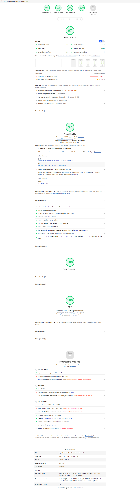

#Space X - launch Program


##Libraries used
- `React` for view component
- `fetch` API polyfill for HTTP requests

##Build and run
###Requirements
- `nodejs version 12`
###Build
- open terminal in `~/SpaceX-launch` directory
- run `npm install` to install packages
- run `npm run build` to build source code


##Source code directory structure
```
src
|--components //components folder within which all components are placed
|  |--fliters
|  |--launchtiles

. .....
...
```


##Unit testing
###Libraries for unit testing
- `jest`


Lighthouse score for performance, SEO and accesibilty

Format: 